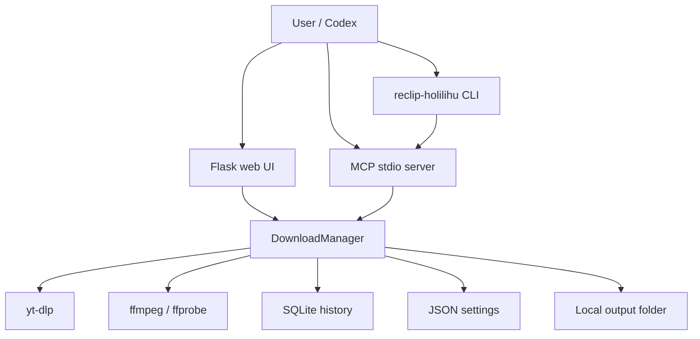

# Architecture

HoLiLiHu ReClip gồm ba lớp chính: web/desktop UI, download manager, và MCP/CLI integration.

## Components

## DownloadManager

`downloader.py` là lõi dùng chung:

- Giữ job store thread-safe bằng lock.
- Dùng `ThreadPoolExecutor` để giới hạn số video tải đồng thời.
- Dùng `concurrent_fragment_downloads` của yt-dlp cho số mảnh tải song song trong từng video.
- Cập nhật trạng thái `queued`, `downloading`, `done`, `error`.
- Ghi lịch sử vào SQLite qua `history.py`.

## Web app

`app.py` chỉ giữ Flask routes và gọi `DownloadManager`.

Các route chính:

- `/api/info`
- `/api/download`
- `/api/status/<job_id>`
- `/api/jobs`
- `/api/history`
- `/api/settings`
- `/api/cookies`

## MCP server

`mcp_server.py` expose tools cho Codex:

- `get_video_info`
- `download_video`
- `download_many`
- `get_download_status`
- `get_runtime_status`
- `list_recent_downloads`

MCP chạy local qua stdio. Codex khởi động process theo config `mcp_servers.holilihu-reclip`.

## CLI

`reclip_holilihu_cli.py` cung cấp:

- `setup-mcp codex`: ghi config MCP cho Codex.
- `print-mcp-config codex`: in config để debug.
- `doctor`: kiểm tra Python, ffmpeg, dependency, Codex config.
- `serve`: chạy web app từ source checkout.
- `run-mcp`: chạy MCP server.

## Desktop build

`desktop.py` chạy Flask trong background thread và mở UI bằng pywebview.

`ReClip.spec`, `create_installer.py`, và `.github/workflows/release-windows.yml` dùng để build installer Windows.
